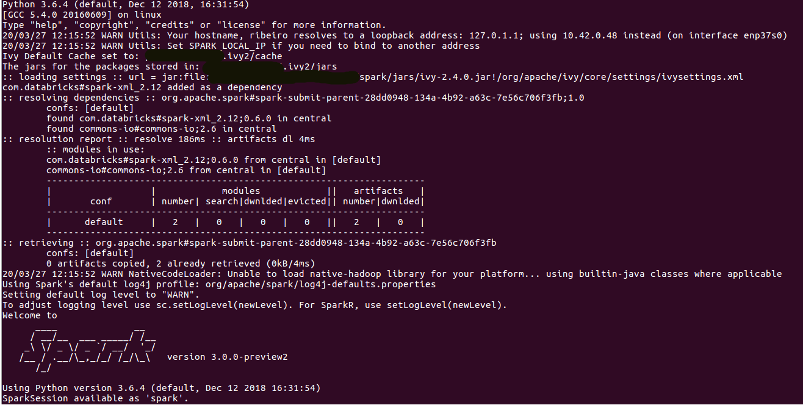
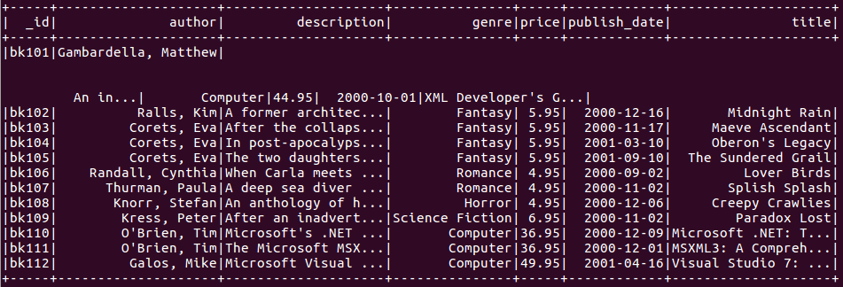
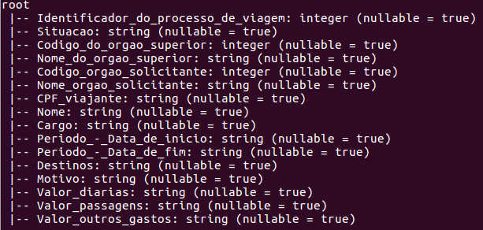

## Passo a passo para resolver o exercicio 2 

Nesta pasta abrir um terminal linux e executar
```
pyspark --packages com.databricks:spark-xml_2.12:0.6.0
```



```
from pyspark.sql.column import Column, _to_java_column
from pyspark.sql.types import _parse_datatype_json_string
def ext_from_xml(xml_column, schema, options={}):
     java_column = _to_java_column(xml_column.cast('string'))
     java_schema = spark._jsparkSession.parseDataType(schema.json())
     scala_map = spark._jvm.org.apache.spark.api.python.PythonUtils.toScalaMap(options)
     jc = spark._jvm.com.databricks.spark.xml.functions.from_xml(
         java_column, java_schema, scala_map)
     return Column(jc)

def ext_schema_of_xml_df(df, options={}):
     assert len(df.columns) == 1
     scala_options = spark._jvm.PythonUtils.toScalaMap(options)
     java_xml_module = getattr(getattr(
         spark._jvm.com.databricks.spark.xml, "package$"), "MODULE$")
     java_schema = java_xml_module.schema_of_xml_df(df._jdf, scala_options)
     return _parse_datatype_json_string(java_schema.json())


import pyspark
from pyspark.sql.functions import *
from pyspark.sql import SparkSession
spark=SparkSession.builder.appName("experian").getOrCreate()
```
Carregando um arquivo .xml para teste
```
fx_1 = spark.read.format('com.databricks.spark.xml').options(rowTag='book').load("books.xml")
fx_1.show()
```



```
df = spark.read.format('csv').options(header='true', inferSchema='true', delimiter = ";").load('../../viagens_csv/2020_Viagem.csv')

for col in df.columns:                                                      
   df = df.withColumnRenamed(col,col.replace(" ", "_"))
df = df.withColumnRenamed('Situa��o','Situacao')\
        .withColumnRenamed('C�digo_do_�rg�o_superior','Codigo_do_orgao_superior')\
        .withColumnRenamed('Nome_do_�rg�o_superior','Nome_do_orgao_superior')\
        .withColumnRenamed('C�digo_�rg�o_solicitante','Codigo_orgao_solicitante')\
        .withColumnRenamed('Nome_�rg�o_solicitante','Nome_orgao_solicitante')\
        .withColumnRenamed('Per�odo_-_Data_de_in�cio','Periodo_-_Data_de_inicio')\
        .withColumnRenamed('Per�odo_-_Data_de_fim','Periodo_-_Data_de_fim')\
        .withColumnRenamed('Valor_di�rias','Valor_diarias') 

df.printSchema()
```


Escrevendo o resultado no formato .xml

```


df.write.format("com.databricks.spark.xml").option("rootTag", "Serasa").option("rowTag", "passagem").save("../resultados/res_2/passagem.xml")
```
